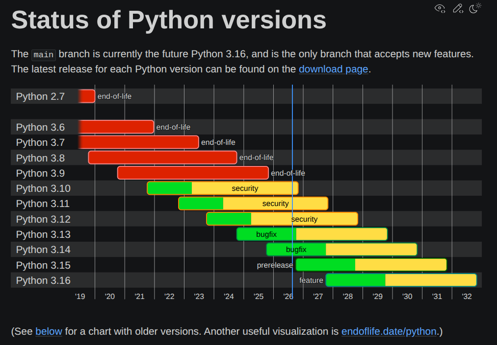

# Python Version 3.14
At the time that this project was built, this version is a good balance between new features/stability. It is the last "stable" version.

# Package manager: UV
This choice was just because I have more experience with, but I know there are some other projects available for this purpose

# Project Structure: pyproject.toml
Following PEP 621: https://peps.python.org/pep-0621/

# Pre-commit, linting, static typing check, etc
For this project I'll try a pretty recent type checker written in Rust called ty. This choice don't have a specific reason, but just the curiosity to see how it behaves (and check if can be faster than MyPy, which was really slow in my past experiences)

